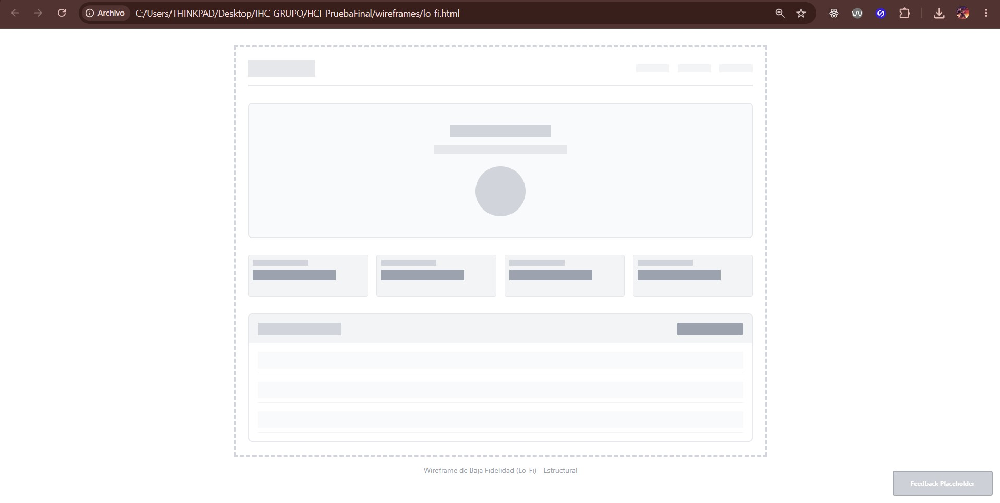
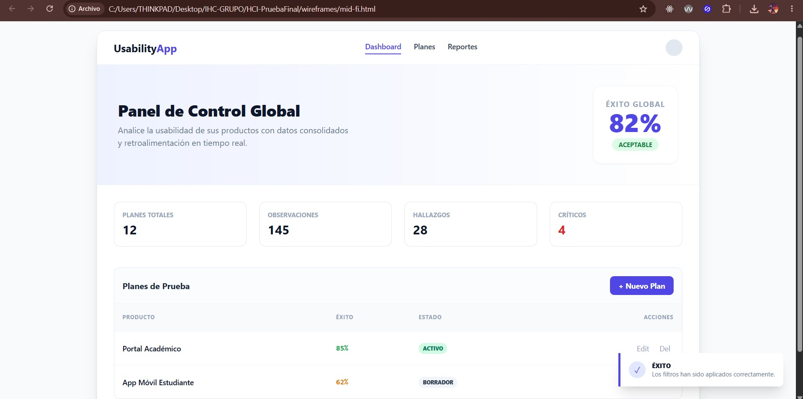
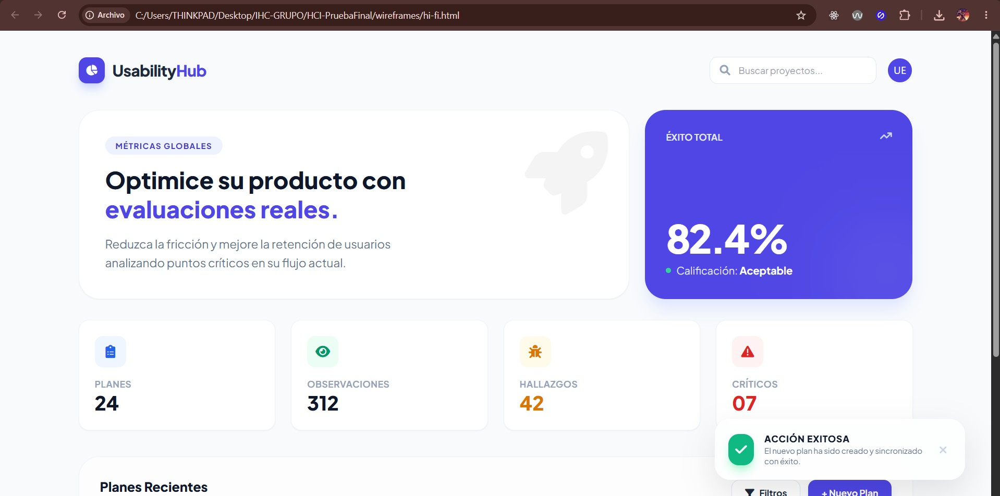

# HCI-PruebaFinal — Documentación de Examen

Este directorio contiene toda la evidencia técnica y documental para la Prueba Práctica Final de la asignatura Interacción Humano Computador.

## Contenido
*   `product_backlog.md`: Listado de historias de usuario priorizadas.
*   `sprint_planning.md`: Planificación del sprint actual y objetivos UX.
*   `heuristic_evaluation.md`: Análisis de usabilidad basado en heurísticas de Nielsen.
*   `ai_evidence.md`: Registro de interacción con IA.
*   `wireframes/`: Prototipos en HTML (Lo-Fi, Mid-Fi, Hi-Fi).

---

## Evidencias de Diseño (Wireframes)
Se han desarrollado prototipos progresivos para el rediseño del Dashboard Global.

| Lo-Fi | Mid-Fi | Hi-Fi |
| :---: | :---: | :---: |
|  |  |  |

---

## Evidencias de Implementación Funcional
Se han implementado 10 mejoras UX visibles en el Dashboard Global.

### 1. Feedback Visual (Toasts)
Confirmaciones inmediatas al interactuar con filtros y búsquedas.

### 2. Acciones Rápidas y Navegación
Mejora en la eficiencia de uso (H7) y control del sistema.

### 3. Estados Vacíos y Accesos Directos
Prevención de errores y guía al usuario.

### 4. Control de Versiones (Commits)
Evidencia de los commits realizados durante el proceso.

## Proyecto: Usability Test Dashboard 2.0
Mejora de la experiencia de usuario mediante principios HCI y control de versiones.
